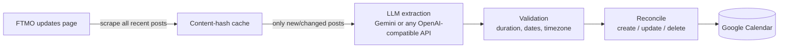

# AutoFtmoCalendar

> Never get caught by an FTMO maintenance window again.

[](https://github.com/Bogzx/AutoFtmoCalendar/actions/workflows/ci.yml)


AutoFtmoCalendar watches [FTMO's trading updates page](https://ftmo.com/en/trading-updates/),
extracts scheduled platform maintenance and market closures with an LLM, and keeps a
dedicated Google Calendar in sync — **including updating or removing events when FTMO
reschedules an announcement**. Events come with popup reminders, so you get warned
*before* the platform goes down, not after.

## Two ways to use it

| Role | What you do | What you need |
| --- | --- | --- |
| **Subscriber** (most people) | Paste a hosted feed URL into Google/Apple/Outlook calendar — done in 30 seconds | Nothing. No accounts, no API keys, no install |
| **Host** (one person per group) | Run one Docker container on any VPS; it scrapes, parses, and publishes the feed for everyone | An LLM API key. Google account optional |

### Subscribe to a hosted feed (30 seconds)

If someone already hosts a feed for your group, add it to your calendar:

- **Google Calendar:** Other calendars → **+** → *From URL* → paste `https://<host>/feed.ics`
- **Apple Calendar:** File → *New Calendar Subscription…* → paste the URL
- **Outlook:** Add calendar → *Subscribe from web* → paste the URL

Your calendar app re-polls the feed automatically; the feed itself carries a
refresh hint matching the host's sync interval.

### Host a feed on your VPS (5 minutes)

Feed-only mode needs **no Google account at all** — one LLM key and one container:

```bash
git clone https://github.com/Bogzx/AutoFtmoCalendar && cd AutoFtmoCalendar
mkdir data
printf '[calendar]\nenabled = false\n' > data/config.toml
cp .env.example .env          # put your LLM_API_KEY in it
docker compose up -d
```

That's it. Your group subscribes to `http://your-vps:8080/feed.ics`, and
`http://your-vps:8080/status` is a shareable page with the next event and
subscribe instructions. `/healthz` reports `ok`, `last_run`, `next_run`, and
`last_error` for uptime monitors. A failing sync never takes the feed down —
the last good data keeps serving and you get a notification (see below).

For public hosting, put it behind a reverse proxy with HTTPS (Caddy/nginx) —
the container itself serves plain HTTP.

## How it works



- **Trustworthy sync.** Every created event carries a stable reconcile key. When an
  announcement changes, stale future events are removed and replaced; events that
  already happened are preserved as history. A lost state file does not cause
  duplicates — events are rediscovered in the calendar by key.
- **Cheap.** Post contents are hashed; unchanged posts cost zero LLM calls.
- **Deterministic.** Temperature-0 extraction with a strict JSON schema, a repair
  retry, model fallback, and sanity validation (end after start, duration caps,
  plausible date window, timezone taken from the announcement's stated offset).
- **Fails loudly.** A broken scraper or expired token exits non-zero with clear
  instructions — it never silently does nothing while you trust an empty calendar.

## Quickstart

```bash
git clone https://github.com/Bogzx/AutoFtmoCalendar
cd AutoFtmoCalendar
python -m venv .venv && . .venv/bin/activate    # Windows: .venv\Scripts\activate
pip install -e .

cp .env.example .env                # add your LLM API key
cp config.example.toml config.toml  # optional: tweak settings

ftmo-calendar auth                  # one-time Google authorization (opens a browser)
ftmo-calendar run --dry-run         # see what it would do
ftmo-calendar run                   # sync for real
```

## Choosing an LLM provider

Any API key works — pick whichever provider you already have.

**Gemini (default).** Free tier available. Get a key at
[aistudio.google.com/apikey](https://aistudio.google.com/apikey) and put it in `.env`
as `LLM_API_KEY`.

**OpenRouter / OpenAI / Groq / Ollama / anything OpenAI-compatible:**

```toml
# config.toml — example: DeepSeek via OpenRouter
[llm]
provider = "openai-compatible"
base_url = "https://openrouter.ai/api/v1"   # or your provider's endpoint
models = ["deepseek/deepseek-v4-flash", "deepseek/deepseek-v3.2"]
```

Set `LLM_API_KEY` in `.env` to your [OpenRouter key](https://openrouter.ai/keys).
Any model on the platform works — `deepseek/deepseek-chat`, `openai/gpt-5-mini`,
`google/gemini-2.5-flash`, … The extractor is robust to model quirks: it strips
reasoning `<think>` blocks (DeepSeek R1 etc.), markdown fences, and prose around
the JSON, and retries with the validation error before falling back to the next
model in `models`.

## Google Calendar setup

### Option A: OAuth (desktop machines)

1. Follow Google's [Calendar API quickstart](https://developers.google.com/workspace/calendar/api/quickstart/python)
   to create a **Desktop app** OAuth client; download `credentials.json` into the
   project directory.
2. **Important — publish your app to Production.** In Google Cloud console →
   *APIs & Services → OAuth consent screen*, click **Publish app**. Apps left in
   *Testing* status get refresh tokens that **expire every 7 days**, which is the
   usual cause of "it keeps asking me to log in". Publishing for personal use does
   not require verification (you'll just see an "unverified app" warning once).
3. Run `ftmo-calendar auth`. A browser opens; grant access. The token is saved to
   `token.json` and auto-refreshes from then on.
4. `ftmo-calendar auth --check` shows token health at any time.

The calendar named in `config.toml` (`Trading` by default) is found or created
automatically.

### Option B: Service account (servers — recommended for cron)

No browser, no token, **nothing ever expires**:

1. In Google Cloud console, create a **service account** and download its JSON key
   as `service_account.json` in the project directory.
2. In [Google Calendar](https://calendar.google.com), create (or pick) a calendar →
   *Settings and sharing* → *Share with specific people* → add the service account's
   email with **Make changes to events**.
3. Copy the calendar's **Calendar ID** (Settings → *Integrate calendar*) into config:

```toml
[calendar]
auth_mode = "service_account"
calendar_id = "xxxxxxxxxxxx@group.calendar.google.com"
```

## Notifications

Get pinged when something changes — or when something breaks. Add a channel to
`.env` and it activates automatically:

```bash
DISCORD_WEBHOOK_URL="https://discord.com/api/webhooks/..."   # and/or:
TELEGRAM_BOT_TOKEN="123456:ABC..."
TELEGRAM_CHAT_ID="123456789"
```

You'll receive messages like:

```
📅 FTMO Calendar updated
➕ ⚠️ FTMO Platform Maintenance — Sat 06 Jun 08:00–14:00 EEST

❌ ftmo-calendar run failed: OAuth token refresh failed (expired or revoked). ...
```

Set `heartbeat_hours = 24` under `[notify]` in `config.toml` for a daily
"✅ alive" ping — so silence always means something is wrong, never that the
tool quietly died.

## ICS feed details

Set `[ics] enabled = true` (forced on automatically in feed-only and serve
modes) and every run writes `ftmo-events.ics`: stable UIDs per event, UTC
times, popup alarms matching `reminders_minutes`, a `REFRESH-INTERVAL` hint
for subscribers, and a source link in each event's description.

`ftmo-calendar serve` exposes it over HTTP alongside operations endpoints:

- `GET /feed.ics` — the calendar feed (add it as "subscribe by URL")
- `GET /status` — shareable page: next event, sync health, subscribe how-to
- `GET /healthz` — JSON with `ok`, `last_run`, `next_run`, `last_error`

Serve mode keeps the feed available from the moment it starts (last good data,
even if the newest sync attempt fails) and notifies a given error only once —
not every interval — until it changes or resolves.

## Scheduling

Exit codes: `0` success, `1` runtime error, `2` configuration/auth error — so your
scheduler can alert you on failure.

**Linux (cron), every 6 hours:**

```cron
0 */6 * * * cd /opt/AutoFtmoCalendar && .venv/bin/ftmo-calendar run >> cron.log 2>&1
```

**Windows (Task Scheduler):**

```powershell
schtasks /Create /TN "FTMO Calendar" /SC HOURLY /MO 6 `
  /TR "C:\path\to\AutoFtmoCalendar\.venv\Scripts\ftmo-calendar.exe --config C:\path\to\AutoFtmoCalendar\config.toml run"
```

## CLI reference

| Command | What it does |
| --- | --- |
| `ftmo-calendar run` | Scrape, extract, and sync the calendar (default command) |
| `ftmo-calendar run --dry-run` | Print planned creates/updates/deletes; touch nothing |
| `ftmo-calendar auth` | One-time interactive Google authorization (OAuth mode) |
| `ftmo-calendar auth --check` | Report credential/token health |
| `ftmo-calendar status` | Show tracked posts and the events created for them |
| `ftmo-calendar serve [--port N]` | Periodic sync + hosted ICS feed and status page |
| `--config PATH` | Use a config file other than `./config.toml` |
| `-v` | Debug logging |

## Troubleshooting

- **"Token refresh failed" every week** → your OAuth app is in *Testing* status.
  Publish it to Production (see setup above), then `ftmo-calendar auth` once more.
  Or switch to a service account and never think about tokens again.
- **"No trading-update posts found"** → FTMO changed their page structure. Please
  [open an issue](https://github.com/Bogzx/AutoFtmoCalendar/issues).
- **LLM quota errors** → add more fallback `models`, or point `provider`/`base_url`
  at a different (or local) provider.
- **Wrong event times** → FTMO states times in GMT+3; the extractor uses the offset
  stated in each announcement. Check `[source] timezone` only if announcements stop
  stating an offset.

## Development

```bash
pip install -e .[dev]
pytest          # run tests
ruff check .    # lint
mypy src        # type-check
```

The architecture and roadmap live in [`docs/superpowers/specs/`](docs/superpowers/specs/).

---

*This is a personal project and is not affiliated with FTMO.*
