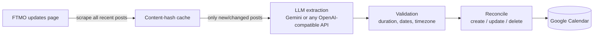

# AutoFtmoCalendar

> Never get caught by an FTMO maintenance window again.

[](https://github.com/Bogzx/AutoFtmoCalendar/actions/workflows/ci.yml)


AutoFtmoCalendar watches [FTMO's trading updates page](https://ftmo.com/en/trading-updates/),
extracts scheduled platform maintenance and market closures with an LLM, and keeps a
dedicated Google Calendar in sync — **including updating or removing events when FTMO
reschedules an announcement**. Events come with popup reminders, so you get warned
*before* the platform goes down, not after.

## How it works



- **Trustworthy sync.** Every created event carries a stable reconcile key. When an
  announcement changes, stale future events are removed and replaced; events that
  already happened are preserved as history. A lost state file does not cause
  duplicates — events are rediscovered in the calendar by key.
- **Cheap.** Post contents are hashed; unchanged posts cost zero LLM calls.
- **Deterministic.** Temperature-0 extraction with a strict JSON schema, a repair
  retry, model fallback, and sanity validation (end after start, duration caps,
  plausible date window, timezone taken from the announcement's stated offset).
- **Fails loudly.** A broken scraper or expired token exits non-zero with clear
  instructions — it never silently does nothing while you trust an empty calendar.

## Quickstart

```bash
git clone https://github.com/Bogzx/AutoFtmoCalendar
cd AutoFtmoCalendar
python -m venv .venv && . .venv/bin/activate    # Windows: .venv\Scripts\activate
pip install -e .

cp .env.example .env                # add your LLM API key
cp config.example.toml config.toml  # optional: tweak settings

ftmo-calendar auth                  # one-time Google authorization (opens a browser)
ftmo-calendar run --dry-run         # see what it would do
ftmo-calendar run                   # sync for real
```

## Choosing an LLM provider

Any API key works — pick whichever provider you already have.

**Gemini (default).** Free tier available. Get a key at
[aistudio.google.com/apikey](https://aistudio.google.com/apikey) and put it in `.env`
as `LLM_API_KEY`.

**OpenRouter / OpenAI / Groq / Ollama / anything OpenAI-compatible:**

```toml
# config.toml
[llm]
provider = "openai-compatible"
base_url = "https://openrouter.ai/api/v1"   # or your provider's endpoint
models = ["google/gemini-2.5-flash", "openai/gpt-5-mini"]
```

`models` is an ordered fallback list — if the first model errors or returns invalid
JSON twice, the next one is tried.

## Google Calendar setup

### Option A: OAuth (desktop machines)

1. Follow Google's [Calendar API quickstart](https://developers.google.com/workspace/calendar/api/quickstart/python)
   to create a **Desktop app** OAuth client; download `credentials.json` into the
   project directory.
2. **Important — publish your app to Production.** In Google Cloud console →
   *APIs & Services → OAuth consent screen*, click **Publish app**. Apps left in
   *Testing* status get refresh tokens that **expire every 7 days**, which is the
   usual cause of "it keeps asking me to log in". Publishing for personal use does
   not require verification (you'll just see an "unverified app" warning once).
3. Run `ftmo-calendar auth`. A browser opens; grant access. The token is saved to
   `token.json` and auto-refreshes from then on.
4. `ftmo-calendar auth --check` shows token health at any time.

The calendar named in `config.toml` (`Trading` by default) is found or created
automatically.

### Option B: Service account (servers — recommended for cron)

No browser, no token, **nothing ever expires**:

1. In Google Cloud console, create a **service account** and download its JSON key
   as `service_account.json` in the project directory.
2. In [Google Calendar](https://calendar.google.com), create (or pick) a calendar →
   *Settings and sharing* → *Share with specific people* → add the service account's
   email with **Make changes to events**.
3. Copy the calendar's **Calendar ID** (Settings → *Integrate calendar*) into config:

```toml
[calendar]
auth_mode = "service_account"
calendar_id = "xxxxxxxxxxxx@group.calendar.google.com"
```

## Scheduling

Exit codes: `0` success, `1` runtime error, `2` configuration/auth error — so your
scheduler can alert you on failure.

**Linux (cron), every 6 hours:**

```cron
0 */6 * * * cd /opt/AutoFtmoCalendar && .venv/bin/ftmo-calendar run >> cron.log 2>&1
```

**Windows (Task Scheduler):**

```powershell
schtasks /Create /TN "FTMO Calendar" /SC HOURLY /MO 6 `
  /TR "C:\path\to\AutoFtmoCalendar\.venv\Scripts\ftmo-calendar.exe --config C:\path\to\AutoFtmoCalendar\config.toml run"
```

## CLI reference

| Command | What it does |
| --- | --- |
| `ftmo-calendar run` | Scrape, extract, and sync the calendar (default command) |
| `ftmo-calendar run --dry-run` | Print planned creates/updates/deletes; touch nothing |
| `ftmo-calendar auth` | One-time interactive Google authorization (OAuth mode) |
| `ftmo-calendar auth --check` | Report credential/token health |
| `ftmo-calendar status` | Show tracked posts and the events created for them |
| `--config PATH` | Use a config file other than `./config.toml` |
| `-v` | Debug logging |

## Troubleshooting

- **"Token refresh failed" every week** → your OAuth app is in *Testing* status.
  Publish it to Production (see setup above), then `ftmo-calendar auth` once more.
  Or switch to a service account and never think about tokens again.
- **"No trading-update posts found"** → FTMO changed their page structure. Please
  [open an issue](https://github.com/Bogzx/AutoFtmoCalendar/issues).
- **LLM quota errors** → add more fallback `models`, or point `provider`/`base_url`
  at a different (or local) provider.
- **Wrong event times** → FTMO states times in GMT+3; the extractor uses the offset
  stated in each announcement. Check `[source] timezone` only if announcements stop
  stating an offset.

## Development

```bash
pip install -e .[dev]
pytest          # run tests
ruff check .    # lint
mypy src        # type-check
```

The architecture and roadmap live in [`docs/superpowers/specs/`](docs/superpowers/specs/).

---

*This is a personal project and is not affiliated with FTMO.*
